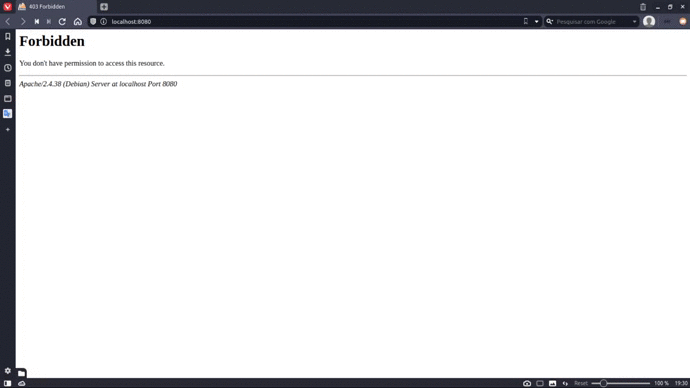

<div align="center">
    <h1 style="margin: 0;">Folder Explorer</h1>
    <h6 style="margin: 0;">Extensão para navegadores<h3>
    <div>
        
        
    </div>
</div>
<h3  align="center">Descrição</h3>
<p  align="center">O uso dessa extensão é para trabalhar com o back para consegui fazer uma navegação pelos diretório direto do navegador</p>
<p align="center">
    
</p>
        
### Uso

    Deve haver uma rota da api disponibilizando so diretórios em formato de json.
    Os Diretórios deve ser um vetor e os arquivos um string dentro dessa array.

    Para adicionar ao seu navegar entre em gerenciador de extensão e ative a opção 'Modo do desenvolvedor' e carregue a pasta da extensão em 'Carregar sem compactação'.

```php
// Exemplo com php
<?php

function listDir($path)
{
    $json = [];
    $handle = opendir($path);
    while ($entry = readdir($handle)) {
        if (!(in_array($entry, [".", ".."]))) {
            if (!strrpos($entry, ".") === false) {
                array_push($json, $entry);
            } else {
                array_push($json, [$entry => listDir($path . "/" . $entry)]);
            }
        }
    }
    closedir($handle);
    return $json;
}
echo json_encode(listDir(__DIR__));
```

### Observação

-   Funcionamento somente em localhost.
-   O arquivo php esta no repositor, ja configurado.
