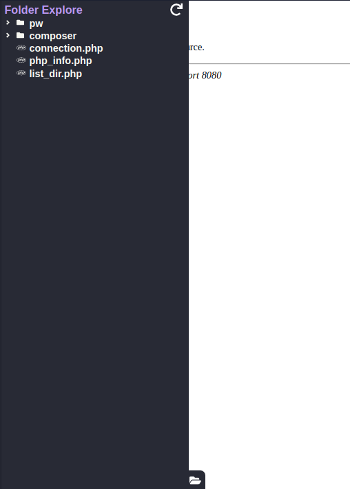
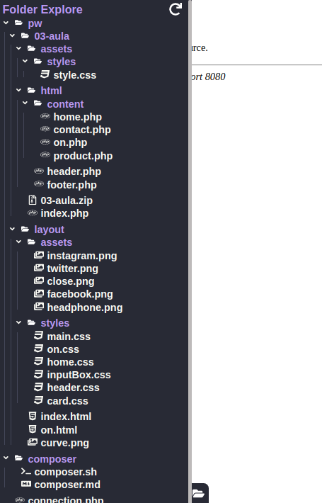

<style>
    .align-center {
        text-align: center;
    }
    .m-0 {
        margin: 0;
    }
    .text-center {
        text-align: center;
    }
    .imgs {
        display: flex;
        justify-content: center;
        align-items: center;
    }
    .imgs img {
        padding: 10px;
        border-radius: 15px;
        background: #ddd;
        height: 400px;
        margin-left: 10px;
    }
    .imgs img:first-child {
        margin: 0; 
    }
</style>

<div class="align-center">
    <h1 class="m-0">Folder Explore</h1>
    <h6 class="m-0">Extensão para navegadores<h3>
    <div>
        
        
        
        
    </div>
</div>
<h3 class="align-center">Descrição</h3>
<p class="text-center">O uso dessa extensão é para trabalhar com o back para consegui fazer uma navegação pelos diretório direto do navegador</p>

<div class="imgs">
    
    
</div>

### Uso
    Deve haver uma rota da api disponibilizando so diretórios em formato de json.
    Os Diretórios deve ser um vetor e os arquivos um string dentro dessa array.
```php
// Exemplo com php
<?php

function listDir($path)
{
    $json = [];
    $handle = opendir($path);
    while ($entry = readdir($handle)) {
        if (!(in_array($entry, [".", ".."]))) {
            if (!strrpos($entry, ".") === false) {
                array_push($json, $entry);
            } else {
                array_push($json, [$entry => listDir($path . "/" . $entry)]);
            }
        }
    }
    closedir($handle);
    return $json;
}
echo json_encode(listDir(__DIR__));
```


### Observação

- A rota deve ser list_dir, ex de rota http://localhost/list_dir.php / http://localhost/list_dir
- Funcionamento somente em localhost;